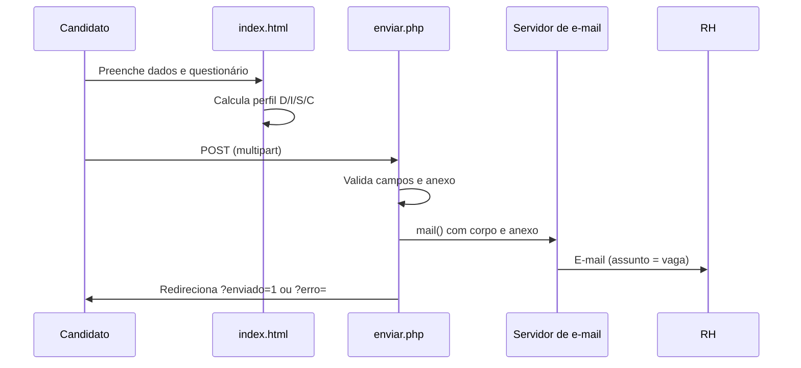

# Avaliação de Perfil RH — Indústria Gráfica

Formulário web para **recrutamento e seleção** em gráficas: coleta dados do candidato, aplica um questionário situacional inspirado no modelo **DISC** (Dominância, Influência, Estabilidade, Conformidade) e envia tudo por **e-mail** para a equipe de RH — com suporte a anexo de currículo.

<p align="center">
  
  
  
  
</p>

---

## Por que este projeto existe

Contratar para **produção gráfica** exige mais do que currículo técnico: o ritmo de chão de fábrica, pressão de prazo e trabalho em equipe pesam na adaptação. Este formulário:

| Objetivo | Como ajuda |
|----------|------------|
| **Triagem comportamental** | 20 cenários reais de gráfica (máquina parada, refugo, prazo impossível) mapeiam tendências D/I/S/C |
| **Dados centralizados** | Nome, vaga, contato, CPF, localização e pretensão salarial em um único envio |
| **Agilidade para o RH** | E-mail com perfil dominante, scores e respostas; assunto = vaga informada pelo candidato |
| **Currículo opcional** | PDF, Word ou imagem (até 8 MB) anexados ao mesmo e-mail |

Não há banco de dados: a solução é **leve**, adequada a hospedagem compartilhada com PHP e `mail()` configurado.

---

## Stack técnica

| Camada | Tecnologia |
|--------|------------|
| Interface | HTML5, CSS3 (layout responsivo), JavaScript vanilla |
| Backend | PHP 7.4+ (recomendado 8.x), `strict_types` |
| Envio | `mail()` nativo, MIME multipart (texto + anexo) |
| Configuração | Arquivo PHP (`config.php`) fora do versionamento |

---

## Estrutura do repositório

```
RH/
├── index.html          # Formulário + questionário + cálculo DISC no cliente
├── enviar.php          # Validação, montagem do e-mail e redirecionamento
├── config.example.php  # Modelo de configuração (versionado)
├── config.php          # Sua configuração local (não versionar)
├── default.php         # Página padrão da hospedagem (pode remover em produção)
├── LICENSE             # Licença proprietária
└── README.md
```

---

## Requisitos

- Servidor com **PHP** e função **`mail()`** ou SMTP configurado no `php.ini`
- Hospedagem **não estática** (GitHub Pages **não** executa PHP)
- Conta de e-mail válida no domínio do site (recomendado para `From` / entregabilidade)

---

## Instalação rápida

1. **Clone** ou copie os arquivos para o diretório público do servidor (ex.: `public_html`).

2. **Configure o destino dos e-mails:**

   ```bash
   cp config.example.php config.php
   ```

   Edite `config.php`:

   ```php
   'para' => 'rh@seudominio.com.br',
   'assunto' => '[RH] Nova candidatura',
   'remetente_email' => null,  // ou noreply@seudominio.com.br
   'remetente_nome' => 'Formulário RH',
   ```

3. Acesse **`index.html`** no navegador e faça um envio de teste.

4. Em produção, defina **`index.html`** como página inicial ou renomeie conforme a hospedagem.

---

## Fluxo de uso



---

## Parâmetros de erro na URL

| Código | Significado |
|--------|-------------|
| `?erro=config` | `config.php` ausente ou e-mail `para` inválido |
| `?erro=campos` | Campos obrigatórios não enviados |
| `?erro=envio` | Falha no `mail()` — verificar SMTP/hospedagem |
| `?enviado=1` | Envio concluído com sucesso |

---

## Segurança e privacidade

- **Não versione** `config.php` (já listado no `.gitignore`).
- O formulário coleta **dados pessoais** (CPF, contato, endereço). Trate conforme a **LGPD** (Lei nº 13.709/2018): base legal, retenção, acesso e exclusão.
- Validação básica no servidor (`strip_tags`, tipos de arquivo, limite de 8 MB).
- Para ambientes exigentes, considere HTTPS, CAPTCHA e envio via SMTP autenticado (PHPMailer, etc.).

---

## Licença

Software **proprietário**. Uso, cópia e distribuição somente com autorização expressa do titular. Consulte o arquivo [LICENSE](LICENSE).

---

## Manutenção

- Ajuste perguntas e opções no array `data` em `index.html`.
- Altere tipos de anexo permitidos em `enviar.php` (`$allowedExt`, `$maxBytes`).
- Remova `default.php` se não for a página inicial da sua hospedagem.
